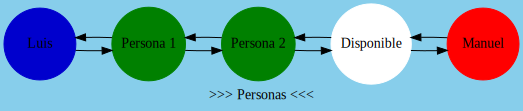
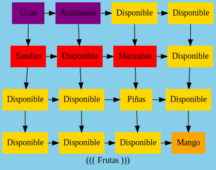
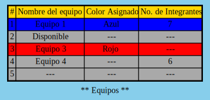
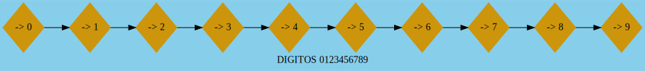
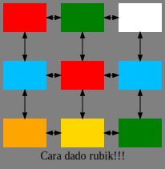
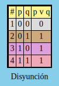

# SimpleGraph

Universidad de San Carlos de Guatemala  
Facultad de Ingeniería  
Escuela de Ciencias y Sistemas  
Lenguajes Formales y de Programación  
Segundo Semestre 2020  
Catedráticos: Inga. Zulma Aguirre, Ing. David Estuardo Morales, Ing. Otto   Rodriguez  
Tutores académicos: Daniel Urias, Luis Manuel Morales, José Manuel Véliz,   Javier Cabrera  

## Archivos de prueba - Proyecto #2  

### [Lista.lfp](Lista.lfp)
```js
lista ('>>> Personas <<<',circulo,verdadero){
    nodo ('Luis') azul2 ;
    nodos (2, 'Persona') verde2;
    nodo (#) #; // Nodo con valores por defecto
    nodo ('Manuel') rojo2;
} defecto ('Disponible') blanco;
```


### [Matriz.lfp](Matriz.lfp)
```js
matriz (4,4,'((( Frutas )))',rectangulo,falso){
    fila ('Uvas', 'Arandanos') morado2;
    fila ('Sandias',#,'Manzanas')rojo2;
    nodo (3,3,'Piñas')#;
    nodo (4,4,'Mango') anaranjado2;
} defecto ('Disponible') amarillo2;
```


### [Tabla.lfp](Tabla.lfp)
```js
tabla (3,'** Equipos **'){
    fila ('Equipo 1', 'Azul', '7') Azul2;
    fila ('Disponible') #;
    fila ('Equipo 3', 'Rojo') Rojo2;
    fila ('Equipo 4',#,6)#;
    encabezados ('Equipo','Color Asignado','No. Integrantes') amarillo2;
    fila (#)#; //Tendrá los valores por defecto

} defecto ('---') gris2; 
```


## ARCHIVOS CON ERRRORES

### [Digitos.lfp](Digitos.lfp)
```js
// ERROR, lista está repedita
lista lista('DIGITOS 0123456789',diamante,falso)
{
    nodo ('-> 0') amarillo3 ;
    # // ERROR, NO SE ESPERABA '#'
    nodos (9, '->') amariLLo3;    
    & // Error, caracter inválido 
} 
defecto ('NADA') CAFE;
```

## Gráfica despues de corregir los errores 




### [Rubik.lfp](Rubik.lfp)
```js
matriz (3,3,'Cara dado rubik!!!',rectangulo,verdadero){
    nodo (1,1, #)       rojo2;
    nodo (1,2, #)       verde3;
    )   // error, no se esperaba ')'
    NODO (2,1,#)    AZUL;
    NODO (2,2,#)    ROJO2;
    NODO (2,3,#)    AZUL;
    $   // caracter no reconocido '$'
    nodo (3,1,#)        anaranjado2;
    nodo (3,2,#)        amarillo2;
    nodo (3,3,#)        verde3;

} 
defecto
defecto // error, 'defecto' repetido
(' ') 
blanco;
```

## Gráfica despues de corregir los errores




### [Disyuncion.lfp](Disyuncion.lfp)
```js
tabla 
    (
        3,
        'Disyunción'
    )
{
    fila ('0', '0', '0') gris;
    encabezados ('p','q','p v q') amarillo;
    fila ('0','1','1') #;
    fila ('1', '0','1') morado;
    fila ('1','1','1') rojo;
    nodo ('Luis') azul2 ;
    //Error, no se esperaba 'nodo'
} defecto ('F') cafe; 

@@ // Error, caracteres invalidos
```

## Gráfica despues de corregir los errores 

